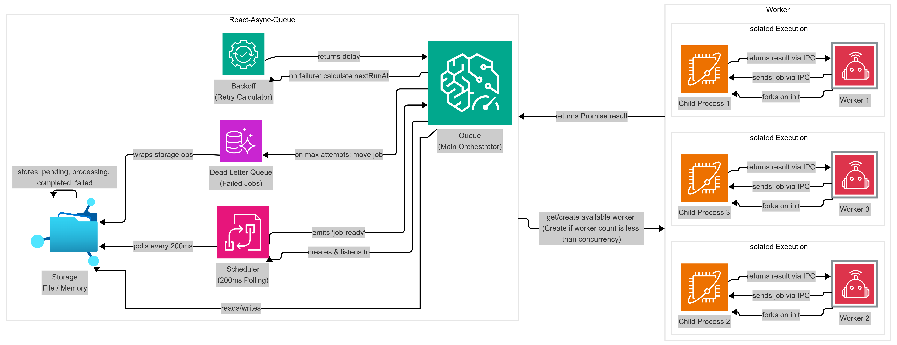

# 🚀 light-async-queue

[](https://www.npmjs.com/package/light-async-queue)
[](https://www.npmjs.com/package/light-async-queue)
[](https://github.com/gaikwadakshay79/light-async-queue/actions/workflows/ci.yml)
[](https://opensource.org/licenses/MIT)
[](https://nodejs.org)
[](https://www.typescriptlang.org/)

A production-ready, Redis-free async job queue for Node.js with TypeScript. Designed for single-node reliability with file-based persistence, worker process isolation, and crash recovery.

## ✨ Features

- **🔄 Reliable Job Processing** - File-based persistence with crash recovery
- **👷 Worker Isolation** - Jobs execute in separate child processes using `child_process.fork()`
- **🔁 Smart Retry Logic** - Exponential backoff with configurable attempts
- **💀 Dead Letter Queue** - Failed jobs are preserved and can be reprocessed
- **⚡ Concurrency Control** - Configurable parallel job execution
- **🛡️ Graceful Shutdown** - Waits for active jobs before exiting
- **📊 Queue Statistics** - Monitor active, pending, completed, and failed jobs
- **🎯 TypeScript First** - Full type safety with no `any` types
- **🪶 Zero Dependencies** - Uses only Node.js built-in modules

## 📦 Installation

```bash
npm install light-async-queue
```

## 🏗️ Architecture



The queue follows a producer-consumer pattern with the following components:

- **Queue API**: Main interface for adding jobs and managing the queue
- **Scheduler**: Polls for ready jobs every 200ms and dispatches to workers
- **Storage Layer**: Pluggable storage (Memory or File-based) for job persistence
- **Worker Pool**: Manages concurrent job execution in isolated child processes
- **Dead Letter Queue (DLQ)**: Stores jobs that exceeded max retry attempts

**Key Features:**

- Jobs execute in isolated child processes for crash resilience
- File-based storage provides automatic crash recovery
- Exponential backoff retry strategy prevents overwhelming failing services
- Graceful shutdown ensures no job loss during deployment

## 🚀 Quick Start

```typescript
import { Queue, StorageType, BackoffStrategyType } from "light-async-queue";

// Create a queue
const queue = new Queue({
  storage: StorageType.FILE,
  filePath: "./jobs.log",
  concurrency: 3,
  retry: {
    maxAttempts: 5,
    backoff: {
      type: BackoffStrategyType.EXPONENTIAL,
      delay: 1000, // 1 second base delay
    },
  },
});

// Define job processor
queue.process(async (job) => {
  console.log("Processing:", job.payload);

  // Your job logic here
  await sendEmail(job.payload.email);

  return { success: true };
});

// Add jobs
await queue.add({
  email: "user@example.com",
  template: "welcome",
});
```

## 📖 API Reference

### `new Queue(config)`

Create a new queue instance.

**Config Options:**

```typescript
import { StorageType, BackoffStrategyType } from "light-async-queue";

interface QueueConfig {
  storage: StorageType;
  filePath?: string; // Required if storage is StorageType.FILE
  concurrency: number; // Max parallel jobs
  retry: {
    maxAttempts: number;
    backoff: {
      type: BackoffStrategyType;
      delay: number; // Base delay in ms
    };
  };
}
```

### `queue.process(processor)`

Set the job processor function.

```typescript
queue.process(async (job: JobData) => {
  // Process job
  return result;
});
```

### `queue.add(payload)`

Add a job to the queue.

```typescript
const jobId = await queue.add({
  userId: 123,
  action: "send-email",
});
```

### `queue.getFailedJobs()`

Get all jobs in the Dead Letter Queue.

```typescript
const failedJobs = await queue.getFailedJobs();
```

### `queue.reprocessFailed(jobId)`

Reprocess a failed job from the DLQ.

```typescript
await queue.reprocessFailed("job-id-here");
```

### `queue.getStats()`

Get queue statistics.

```typescript
const stats = await queue.getStats();
// {
//   active: 2,
//   pending: 5,
//   completed: 100,
//   failed: 3
// }
```

### `queue.shutdown()`

Gracefully shutdown the queue.

```typescript
await queue.shutdown();
```

## 🔄 Retry & Backoff

Jobs are retried with exponential backoff:

```
delay = baseDelay * (2 ^ (attempt - 1))
```

**Example with 1000ms base delay:**

- Attempt 1: Immediate
- Attempt 2: 1 second delay
- Attempt 3: 2 seconds delay
- Attempt 4: 4 seconds delay
- Attempt 5: 8 seconds delay

After `maxAttempts`, jobs move to the Dead Letter Queue.

## 💾 Storage Options

### Memory Storage

Fast, in-memory storage for development:

```typescript
import { Queue, StorageType } from "light-async-queue";

const queue = new Queue({
  storage: StorageType.MEMORY,
  concurrency: 5,
  retry: {
    /* ... */
  },
});
```

### File Storage

Persistent, crash-recoverable storage for production:

```typescript
import { Queue, StorageType } from "light-async-queue";

const queue = new Queue({
  storage: StorageType.FILE,
  filePath: "./jobs.log",
  concurrency: 5,
  retry: {
    /* ... */
  },
});
```

**File Format:**

- Append-only log
- One JSON object per line
- Atomic writes
- Separate `dead-letter.log` for failed jobs

## 🛡️ Crash Recovery

When using file storage, the queue automatically recovers from crashes:

1. **On startup**, the queue reads the job log
2. Any job with status `"processing"` is marked as `"pending"`
3. The job's `attempts` counter is incremented
4. The job is scheduled for immediate retry

This ensures no jobs are lost during unexpected shutdowns.

## 👷 Worker Isolation

Jobs execute in isolated child processes:

- **Process Isolation**: Each job runs in a separate Node.js process
- **Crash Detection**: Parent detects worker crashes and retries the job
- **IPC Communication**: Results are sent back via inter-process communication
- **Resource Cleanup**: Workers are properly terminated on shutdown

## 🔒 Graceful Shutdown

The queue handles `SIGINT` and `SIGTERM` signals:

1. Stop accepting new jobs
2. Wait for active jobs to complete
3. Terminate all worker processes
4. Persist final state to disk
5. Exit cleanly

```typescript
// Automatic on SIGINT/SIGTERM
// Or manual:
await queue.shutdown();
```

## 📊 Comparison with Bull

| Feature          | light-queue      | Bull                |
| ---------------- | ---------------- | ------------------- |
| Redis Required   | ❌ No            | ✅ Yes              |
| File Persistence | ✅ Yes           | ❌ No               |
| Worker Isolation | ✅ Child Process | ⚠️ Same Process     |
| Crash Recovery   | ✅ Built-in      | ⚠️ Requires Redis   |
| Setup Complexity | 🟢 Low           | 🟡 Medium           |
| Best For         | Single-node apps | Distributed systems |

## 🎯 Use Cases

Perfect for:

- **Single-server applications** that don't need Redis
- **Background job processing** (emails, reports, etc.)
- **Reliable task queues** with crash recovery
- **Development environments** without external dependencies
- **Edge deployments** where Redis isn't available

## 🔧 Advanced Example

```typescript
import { Queue, StorageType, BackoffStrategyType } from "light-async-queue";

const queue = new Queue({
  storage: StorageType.FILE,
  filePath: "./production-jobs.log",
  concurrency: 10,
  retry: {
    maxAttempts: 3,
    backoff: {
      type: BackoffStrategyType.EXPONENTIAL,
      delay: 2000,
    },
  },
});

// Email sending processor
queue.process(async (job) => {
  const { email, template, data } = job.payload;

  try {
    await emailService.send({
      to: email,
      template,
      data,
    });

    return { sent: true, timestamp: Date.now() };
  } catch (error) {
    // Will retry with exponential backoff
    throw error;
  }
});

// Add jobs
await queue.add({
  email: "user@example.com",
  template: "welcome",
  data: { name: "John" },
});

// Monitor failed jobs
setInterval(async () => {
  const stats = await queue.getStats();
  console.log("Queue stats:", stats);

  if (stats.failed > 0) {
    const failed = await queue.getFailedJobs();
    console.log("Failed jobs:", failed);
  }
}, 60000);
```

## 🧪 Testing

```bash
# Run all tests
npm test

# Run tests in watch mode
npm run test:watch

# Run tests with coverage
npm run test:coverage

# Run examples
npm install
npm run build
npm run example
```

**Test Results:** ✅ 42 tests passing across 4 test suites (powered by Vitest)

See [TEST_SUITE.md](./TEST_SUITE.md) for detailed test documentation.

## 📝 License

MIT

## 🤝 Contributing

Contributions welcome! This is a production-ready implementation focused on reliability and simplicity.

---

Built with ❤️ for Node.js developers who need reliable job queues without Redis.
